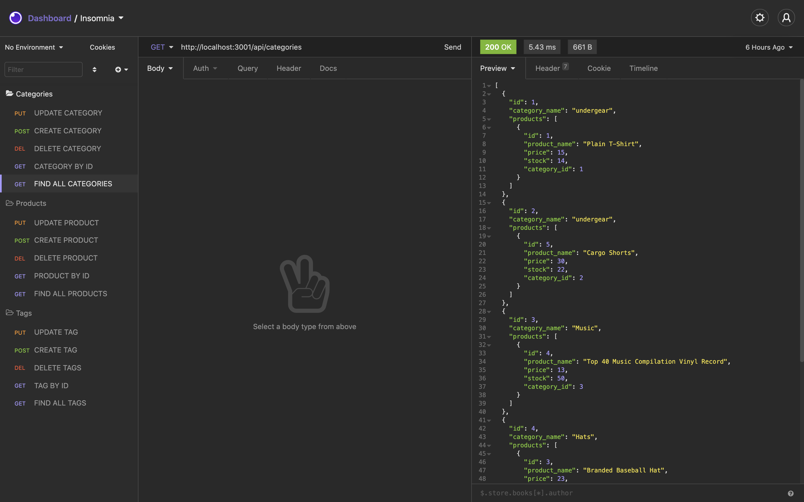
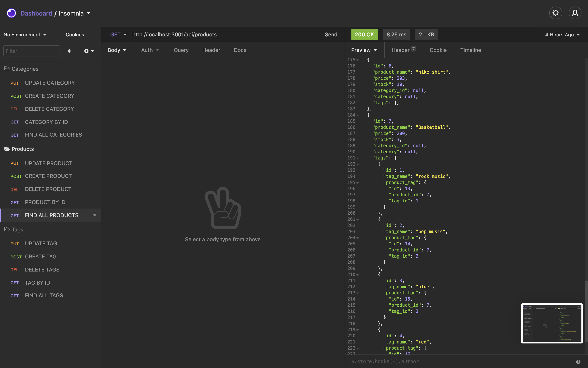
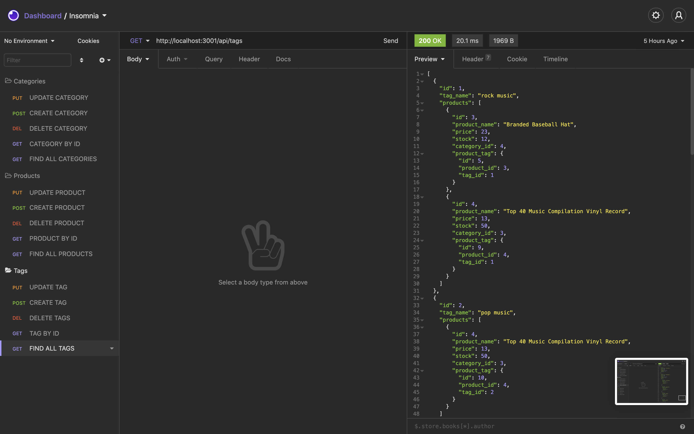

# e-commerce

## Description
this is an  e commerce project its meant to grab products ,and different categories from the back end using get,post,put and delete routes to send information back to the front end.

## Installation
 these are the dependencies required. Intialize node package manager and then run the following commands;
 npm install
npm install mysql2
npm install sequelize
npm install dotenv
## Usage
 clone the repo from https://github.com/johnbatista1223/e-commerce you can use visual studio code as ide then openIn order to use the application, 
Then, in the sql shell and return to the command line still within your root project folder.
Run the following commands;
npm run seed
npm start
 
 
 

## License
MIT License

Copyright (c) [2021] [john batista]

Permission is hereby granted, free of charge, to any person obtaining a copy
of this software and associated documentation files (the "Software"), to deal
in the Software without restriction, including without limitation the rights
to use, copy, modify, merge, publish, distribute, sublicense, and/or sell
copies of the Software, and to permit persons to whom the Software is
furnished to do so, subject to the following conditions:

The above copyright notice and this permission notice shall be included in all
copies or substantial portions of the Software.

THE SOFTWARE IS PROVIDED "AS IS", WITHOUT WARRANTY OF ANY KIND, EXPRESS OR
IMPLIED, INCLUDING BUT NOT LIMITED TO THE WARRANTIES OF MERCHANTABILITY,
FITNESS FOR A PARTICULAR PURPOSE AND NONINFRINGEMENT. IN NO EVENT SHALL THE
AUTHORS OR COPYRIGHT HOLDERS BE LIABLE FOR ANY CLAIM, DAMAGES OR OTHER
LIABILITY, WHETHER IN AN ACTION OF CONTRACT, TORT OR OTHERWISE, ARISING FROM,
OUT OF OR IN CONNECTION WITH THE SOFTWARE OR THE USE OR OTHER DEALINGS IN THE
SOFTWARE.